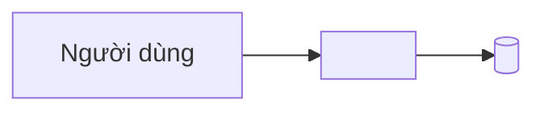

# Kiến trúc

> **Trả lời:** Hệ thống ghép lại thế nào, ranh giới giữa các phần ở đâu?
> **Trạng thái:** 🔴 chưa điền
> **Cập nhật:** — · commit —
> **Cập nhật khi:** thêm/bỏ một module hoặc service · đổi cách hai module nói chuyện

<!-- CÁCH ĐIỀN
Mức độ: C4 mức 1 (context) và mức 2 (container). KHÔNG đi xuống class hay function —
đó là code, và code là bản mô tả chính xác nhất của chính nó.

Mục 3 (ranh giới module) là mục AI dùng nhiều nhất: nó quyết định code mới nên đặt
ở đâu. Viết mỗi module một dòng: tên · trách nhiệm một câu · được phép gọi ai.

Mục 5 chỉ ghi TÊN công nghệ + số ADR. LÝ DO chọn nằm trong ADR, không nằm đây —
nếu lý do bị chép vào đây thì hai bản sẽ lệch.

KHÔNG chứa: lý do chọn công nghệ (-> decisions/), bất biến (-> invariants.md),
schema chi tiết (-> file schema của ORM), danh sách chức năng (-> 02-requirements/scope.md).
-->

## 1. Context — hệ thống nằm giữa ai với ai



## 2. Container — hệ thống gồm những khối chạy được nào

```mermaid
graph TD
  %% TODO: web / api / worker / db / cache ... và mũi tên giữa chúng
```

## 3. Module và ranh giới

| Module | Trách nhiệm một câu | Được phép gọi | **Không** được gọi |
| --- | --- | --- | --- |
| <!-- TODO --> | | | |

## 4. Luồng dữ liệu của đường đi quan trọng nhất

<!-- TODO: một luồng, kể theo bước: request vào đâu -> qua tầng nào -> ghi gì -> trả gì.
     Chỉ cần 1-2 luồng. Chọn luồng mà mọi thứ khác đi theo. -->

## 5. Tech stack

| Lớp | Công nghệ | Biện minh |
| --- | --- | --- |
| <!-- TODO --> | | ADR-00xx |
