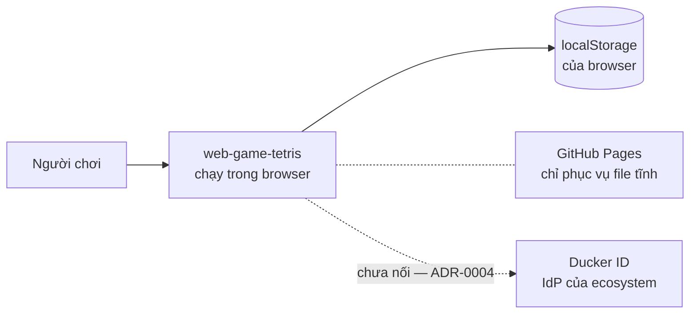
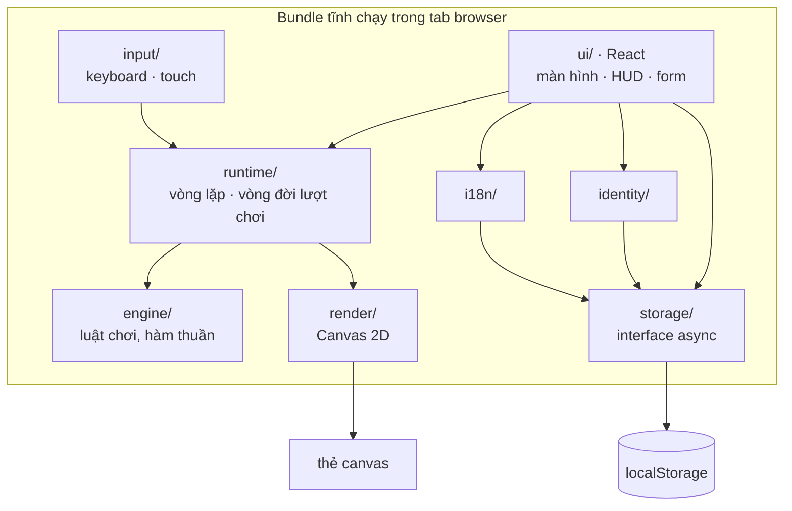

# Kiến trúc

> **Trả lời:** Hệ thống ghép lại thế nào, ranh giới giữa các phần ở đâu?
> **Trạng thái:** 🟢 đủ
> **Cập nhật:** 2026-09-03 · commit 0010a0f
> **Cập nhật khi:** thêm/bỏ một module hoặc service · đổi cách hai module nói chuyện

<!-- CÁCH ĐIỀN
Mức độ: C4 mức 1 (context) và mức 2 (container). KHÔNG đi xuống class hay function —
đó là code, và code là bản mô tả chính xác nhất của chính nó.

Mục 3 (ranh giới module) là mục AI dùng nhiều nhất: nó quyết định code mới nên đặt
ở đâu. Viết mỗi module một dòng: tên · trách nhiệm một câu · được phép gọi ai.

Mục 5 chỉ ghi TÊN công nghệ + số ADR. LÝ DO chọn nằm trong ADR, không nằm đây —
nếu lý do bị chép vào đây thì hai bản sẽ lệch.

KHÔNG chứa: lý do chọn công nghệ (-> decisions/), bất biến (-> invariants.md),
schema chi tiết (-> file schema của ORM), danh sách chức năng (-> 02-requirements/scope.md).
-->

## 1. Context — hệ thống nằm giữa ai với ai

Không có backend, không có database, không có analytics. Mũi tên tới Ducker ID là
đường **chưa tồn tại** — vẽ ra vì nó quyết định hình dạng của `identity/` hôm nay.

## 2. Container — hệ thống gồm những khối chạy được nào

Đúng **một** khối triển khai được: một bundle tĩnh. Sơ đồ dưới chia theo module bên
trong bundle đó, vì đó là ranh giới thật; không có tiến trình thứ hai nào.

## 3. Module và ranh giới

| Module | Trách nhiệm một câu | Được phép gọi | **Không** được gọi |
| --- | --- | --- | --- |
| `engine/` | Toàn bộ luật chơi dưới dạng state + `reduce` thuần khiết | chỉ `engine/` | **mọi module khác**, kể cả `runtime/` |
| `runtime/` | Vòng lặp fixed-timestep và vòng đời một lượt chơi; phát event ra ngoài | `engine/` · `render/` · type của `input/` | `ui/` · `storage/` · `identity/` · `i18n/` |
| `input/` | Dịch sự kiện thiết bị thành `Command` có press/release | type của `engine/` | `engine.reduce()` · `runtime/` · `ui/` · `render/` |
| `render/` | Vẽ state lên canvas, không giữ state riêng | type + state của `engine/` | `runtime/` · `ui/` · `input/` · `storage/` |
| `storage/` | Đọc/ghi thiết lập, điểm cao, replay qua interface async | — | tất cả |
| `identity/` | Cung cấp danh tính hiện tại qua interface async | `storage/` | `engine/` · `runtime/` · `render/` · `ui/` |
| `i18n/` | Tra chuỗi theo locale đang chọn | `storage/` (đọc locale đã lưu) | `engine/` · `runtime/` · `render/` |
| `ui/` | React: điều hướng màn hình, HUD, form cài đặt, bảng điểm | `runtime/` · `storage/` · `identity/` · `i18n/` · type của `engine/` · `render/` **chỉ để khởi tạo** | `render.draw()` · `engine.reduce()` |

Hai ranh giới dễ bị phá nhất, ghi rõ để khỏi phải suy luận lại:

- **`runtime/` không được ghi storage.** Kết thúc lượt thì nó **phát event**; `ui/`
  nhận event rồi mới lưu. Nếu `runtime/` gọi `storage/`, vòng lặp game phụ thuộc I/O.
- **`ui/` khởi tạo `render/` nhưng không vẽ.** Component React tạo thẻ `canvas` rồi
  đưa nó cho `runtime/`; chỉ `runtime/` gọi `draw()` mỗi frame.

## 4. Luồng dữ liệu của đường đi quan trọng nhất

**Luồng 1 — một frame khi đang chơi (đường đi nóng, 60 lần/giây):**

1. `keydown`/`keyup` hoặc chạm màn hình → `input/` dịch thành `Command`
   (`MoveLeft`, `RotateCW`, `HardDrop`, `Hold`…) kèm press hay release, đẩy vào queue.
2. `requestAnimationFrame` gọi `runtime/loop`: cộng thời gian thật vào accumulator,
   rồi chạy `state = reduce(state, cmds)` đúng số tick cần thiết, **tối đa 5 tick**.
   DAS/ARR được đếm bên trong `reduce`, không phải bên ngoài.
3. `runtime/` gọi `render.draw(state)` — vẽ board, khối đang rơi, ghost, hàng chờ.
4. `runtime/` phát event HUD ở **nhịp thấp** (~10Hz) cho `ui/` để cập nhật điểm và
   cấp độ. Không phát mỗi frame.

**Luồng 2 — kết thúc lượt (đường đi lạnh, một lần mỗi lượt):**

1. `reduce` đặt `phase = 'gameOver'`.
2. `runtime/session` dừng vòng lặp và phát `onGameOver({ stats, seed, commands })`.
3. `ui/` nhận event, gọi `storage/` lưu kết quả và replay, rồi hiện màn hình kết quả.
4. Nếu `storage/` lỗi hoặc bị chặn, `ui/` vẫn hiện kết quả và báo là không lưu được
   (NFR-REL-03) — lượt chơi không bị mất theo lỗi ghi.

## 5. Tech stack

| Lớp | Công nghệ | Biện minh |
| --- | --- | --- |
| Build · dev server | Vite | ADR-0001 |
| Ngôn ngữ | TypeScript | ADR-0001 |
| Package manager | npm | ADR-0001 |
| Tầng UI | React | ADR-0001 |
| Test | Vitest | ADR-0001 |
| Luật chơi | TypeScript thuần, deterministic, RNG inject | ADR-0002 |
| Vẽ bàn chơi | Canvas 2D | ADR-0003 |
| Vòng lặp | `requestAnimationFrame` + fixed-timestep, chạy ngoài React | ADR-0003 |
| Lưu trữ | `localStorage` sau interface async | ADR-0004 |
| Định danh | `LocalIdentity`; Ducker ID hoãn | ADR-0004 |
| DAS/ARR | tính trong `engine/` | ADR-0005 |
| i18n | lớp `t()` tự viết, 2 locale `en`/`vi` | ADR-0006 |
| Hosting | GitHub Pages, file tĩnh | ADR-0001 |

Phiên bản cụ thể của React/Vite/Vitest được chốt lúc scaffold và nằm trong
`package.json` — không chép số phiên bản vào đây để hai bản không lệch nhau.
